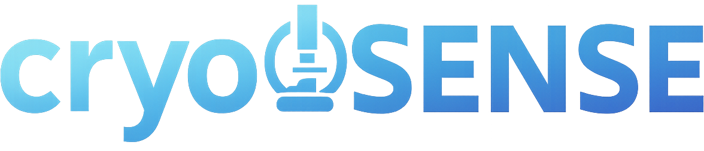
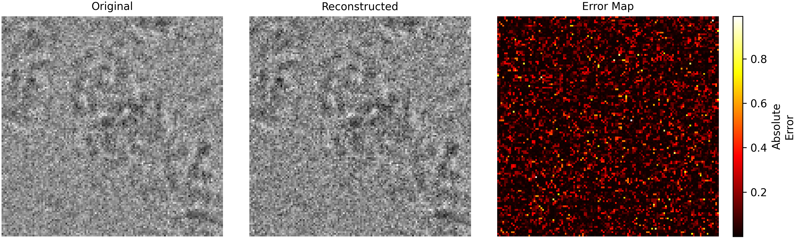
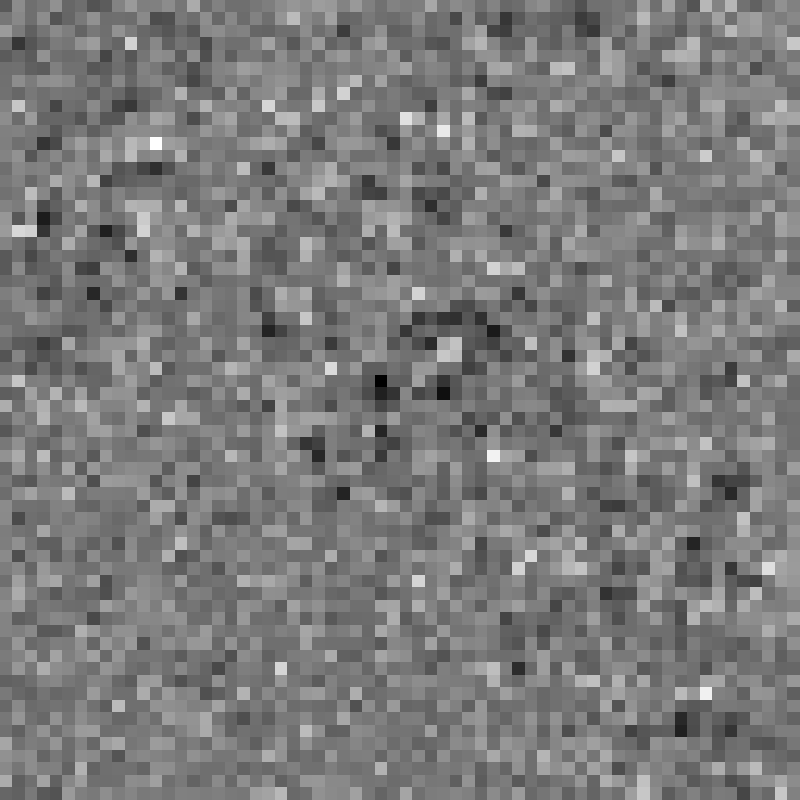
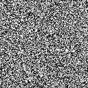
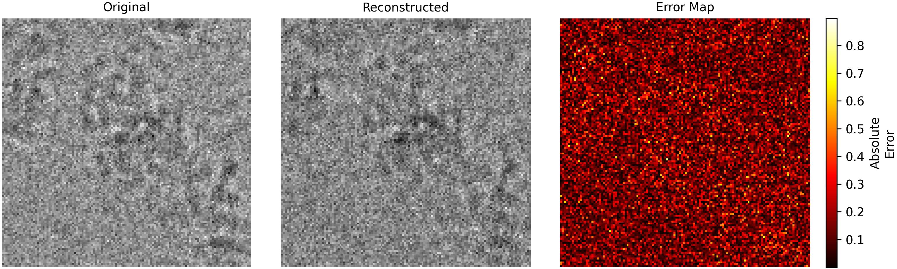
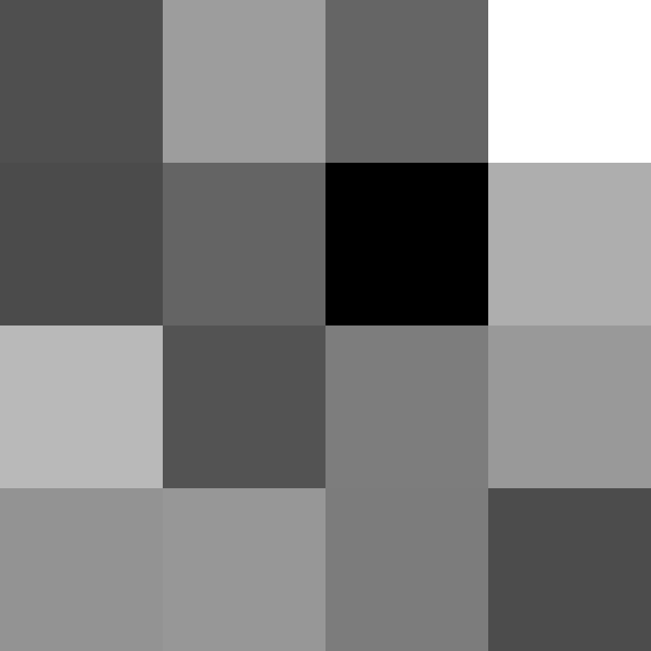
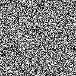

# CryoGEN: CryoEM Image Reconstruction with Diffusion Models



Deep generative models have recently shown promise as priors for solving inverse problems, enabling image recovery without reliance on sparsity assumptions on a pre-defined basis. Diffusion models, in particular, have enabled super-resolution, inpainting, and deblurring of natural images by learning data distributions over low-dimensional image manifolds. However, scientific imaging modalities, such as cryo-electron microscopy (cryo-EM), demand accurate rather than merely perceptually plausible reconstructions, as visually minor errors can lead to incorrect structural interpretations. 

CryoGEN is a generative model for solving the cryo-EM inverse problem of reconstructing biologically accurate high-resolution images from compressed, low-resolution linear measurements. CryoGEN couples an unconditional denoising diffusion probabilistic model (DDPM) trained on cryo-EM data with Nesterov-accelerated gradients to steer the reverse diffusion toward a solution consistent with the compressed measurements. We demonstrate that CryoGEN enables high-resolution recovery from inputs up to 32× lower resolution. Furthermore, CryoGEN reconstructions preserve the critical structural information required for downstream analysis, including atomic model building and conformational heterogeneity analysis.

## Installation

### From PyPI (recommended)

We will enable this option in camera-ready version.
```bash
pip install cryogen
```

### From Source

```bash
git clone X
cd CryoGEN
pip install -e .
```

## Quick Start

### Command-line Interface

```bash
# Basic usage
cryogen --model /path/to/ddpm/model --cryoem_path /path/to/cryoem/data.pt --start_id 0 --end_id 10

# Advanced options
cryogen --model /path/to/ddpm/model \
        --cryoem_path /path/to/cryoem/data.pt \
        --block_size 16 \
        --num_masks 50 \
        --mask_type random_binary \
        --zeta_scale 0.1 \
        --zeta_min 0.01 \
        --num_timesteps 1000 \
        --beta 0.9 \
        --beta_min 0.1 \
        --start_id 0 \
        --end_id 10 \
        --batch_size 4 \
        --noise_level 0.05 \
        --result_dir ./reconstruction_results

# With verbose output and visualizations
cryogen --model /path/to/ddpm/model \
        --cryoem_path /path/to/cryoem/data.pt \
        --start_id 0 \
        --end_id 0 \
        --result_dir ./verbose_results \
        --verbose

# Using configuration files for optimal parameters
cryogen --model /path/to/ddpm/model \
        --cryoem_path /path/to/cryoem/data.pt \
        --block_size 32 \
        --use_config \
        --start_id 0 \
        --end_id 10 \
        --result_dir ./config_results
```

### Python API

```python
from CryoGEN.main import CryoGEN

# Initialize CryoGEN with a pretrained DDPM model
cryogen = CryoGEN(
    model_path="/path/to/ddpm/model",
    block_size=16,
    result_dir="./results",
    verbose=True,  # Enable detailed visualizations
    use_config=True  # Use recommended parameters from configuration files
)

# Reconstruct images from a CryoEM dataset
reconstructed_images, original_images, metrics = cryogen.reconstruct_from_cryoem(
    file_path="/path/to/cryoem/data.pt",
    image_ids=[0, 1, 2],  # Process images with these IDs
    num_masks=30,
    mask_type="random_binary",
    num_timesteps=1000
    # Parameters like zeta_scale and beta will be loaded from the configuration file
)

# Access reconstruction metrics
for metric in metrics:
    print(f"Image ID: {metric['image_id']}, PSNR: {metric['PSNR']}, SSIM: {metric['SSIM']}")
```

## Demonstration

CryoGEN enables high-quality reconstruction across different downsampling levels. Below we demonstrate two configurations:

### Low Compression (Block Size 2, 4 Masks)

With minimal compression (block size 2), CryoGEN can reconstruct high-quality images using just 4 masks:



The reconstruction is guided by compressed measurements:



The diffusion process gradually builds the image from random noise:



### High Compression (Block Size 32, 1024 Masks)

Even with extreme compression (block size 32), CryoGEN reconstructs detailed protein structures using 1024 masks:



The reconstruction is guided by highly compressed measurements:



The diffusion process showing progressive refinement:



## Example Scripts

CryoGEN includes ready-to-use example scripts for quick testing and demonstration:

### Python Example

```bash
python examples/simple_example.py
```

### Bash Example

```bash
bash examples/simple_example.sh
```

These example scripts demonstrate CryoGEN's capabilities with the following features:

- **No manual downloads required**: A sample image is included in the `data/` directory
- **Pre-trained model**: Uses the anonymously uploaded DDPM model (`anonymousneurips008/empiar10076-ddpm-ema-cryoem-128x128`) from HuggingFace
- **Configurable block size**: The block size parameter can be changed to any of {2, 4, 8, 16, 32}, adjust the number of masks accordingly.
  - Example scripts demonstrate both block sizes 32 and 2
  - Different block sizes automatically use appropriate configuration parameters
- **Results visualization**: Both examples include verbose output with detailed visualizations

The scripts demonstrate reconstruction with different parameter combinations:
1. Block size 32 with 1024 masks
2. Block size 2 with 4 masks

## Experiment Scripts

CryoGEN also provides more advanced scripts for comprehensive experiments and batch processing:

### Grid Search Experiments

```bash
python scripts/run_experiments.py
```

The `run_experiments.py` script reproduces the results from the paper, specifically the LPIPS and SSIM scores for CryoGEN reconstructions across five downsampling levels (2x-32x). Features include:

- Performs grid search over multiple parameters:
  - Block sizes: 2, 4, 8, 16, 32 (corresponding to 2x-32x downsampling)
  - Number of masks: Varies based on block size
  - Mask types: random_binary, random_gaussian, etc.
  - Noise levels: 0.0, 0.1, etc.
- Analyzes results and identifies optimal configurations
- Generates comprehensive reports with metrics (PSNR, SSIM, LPIPS)
- Supports running on multiple GPUs in parallel

### Batch Reconstruction

```bash
python scripts/reconstruct_all_images.py
```

The `reconstruct_all_images.py` script can be used for reconstructing all images of a dataset using one specific configuration (block size, number of masks) distributed across multiple GPUs. Features include:

- Processes entire datasets efficiently
- Distributes work automatically across available GPUs
- Uses a fixed optimal configuration for reconstruction
- Generates comprehensive metrics for all processed images
- Supports various input formats including PyTorch tensors and MRC files

## Pretrained Models

The following DDPM models are available on Huggingface and can be used directly with CryoGEN:

| Model | Resolution | Description |
|-------|------------|-------------|
| anonymousneurips008/empiar10076-ddpm-ema-cryoem-128x128 | 128×128 | EMPIAR10076 |
| anonymousneurips008/empiar11526-ddpm-ema-cryoem-128x128 | 128×128 | EMPIAR11526 |
| anonymousneurips008/empiar10166-ddpm-ema-cryoem-128x128 | 128×128 | EMPIAR10166  |
| anonymousneurips008/empiar10786-ddpm-ema-cryoem-128x128 | 128×128 | EMPIAR10786 |
| anonymousneurips008/empiar10648-ddpm-cryoem-256x256 | 256×256 | EMPIAR10648 |

You can specify these models directly in the command line or API calls without downloading them:

```bash
cryogen --model anonymousneurips008/empiar10076-ddpm-ema-cryoem-128x128 --cryoem_path /path/to/data
```

## Command-line Options

| Option | Description | Default |
|--------|-------------|---------|
| `--model` | Path to the pretrained DDPM model | (required) |
| `--cryoem_path` | Path to the CryoEM dataset file | (required) |
| `--block_size` | Block size for downsampling | 4 |
| `--num_masks` | Number of binary masks to use | 30 |
| `--mask_prob` | Probability for binary mask generation | 0.5 |
| `--mask_type` | Type of mask to use (random_binary, random_gaussian, checkerboard) | random_binary |
| `--zeta_scale` | Scale factor for the gradient step size | (from config) |
| `--zeta_min` | Initial scale factor for the gradient step size | (from config) |
| `--num_timesteps` | Number of diffusion timesteps | 1000 |
| `--beta` | Final momentum factor for updates | (from config) |
| `--beta_min` | Initial momentum factor for updates | (from config) |
| `--start_id` | Starting index of images to process | 0 |
| `--end_id` | Ending index of images to process | 0 |
| `--batch_size` | Number of images to process in each batch | 1 |
| `--noise_level` | Gaussian noise standard deviation for measurements | 0.0 |
| `--result_dir` | Directory to save results | results |
| `--device` | Device to use (cuda or cpu) | cuda |
| `--verbose` | Enable verbose mode with detailed visualizations | False |
| `--use_config` | Use recommended configuration parameters based on block size | False |

## Configuration Files

CryoGEN includes configuration files with recommended parameters based on the block size. The system automatically selects the appropriate configuration based on your specified block size.

### Recommended Parameters

| Block Size | zeta_scale | zeta_min | beta | beta_min |
|------------|------------|----------|------|----------|
| 2, 4, 8, 16 | 1.0 | 1e-2 | 0.9 | 0.1 |
| 32, 64 | 10.0 | 1e-2 | 0.9 | 0.1 |

To use these recommended configurations, either:
1. Pass `--use_config` on the command line, or
2. Set `use_config=True` when creating a CryoGEN instance in code

You can override any specific parameter by explicitly providing it, and the system will use the configuration value for any unspecified parameters.

## Verbose Mode Output

When the `--verbose` flag is enabled, CryoGEN will generate and save:

1. All binary masks used for measurements
2. All measurement images for each mask
3. Reconstructed images in PNG format
4. Comparison images showing original, reconstructed, and error maps
5. A GIF animation showing the diffusion process from t=1000 to t=1

Regardless of whether verbose mode is enabled, CryoGEN always saves:
- Raw reconstructed image tensors (.pt files)
- Reconstruction metrics in CSV format

## Supported Data Formats

- PyTorch tensor files (`.pt`) containing CryoEM images
- MRC files (`.mrcs`) containing CryoEM images

## Requirements

- Python 3.13.2
- PyTorch 2.7.0
- diffusers 0.33.1
- accelerate 1.7.0
- numpy 2.2.6
- scikit-image 0.25.2
- lpips 0.1.4
- mrcfile 1.5.4
- matplotlib 3.10.3
- imageio 2.37.0
- CUDA-capable GPU (recommended)


# Datasets

The following datasets are available on Huggingface:

| Dataset  | Description |
|-------|-------------------------|
| anonymousneurips008/3D_Volumes_EMPIAR10076 | 3D volumes of EMPIAR10076 |
| anonymousneurips008/3D_Volumes_EMPIAR10648 | 3D volumes of EMPIAR10648 |
| anonymousneurips008/EMPIAR10076_128x128 | EMPIAR10076 128x128 Images |
| anonymousneurips008/EMPIAR11526_128x128 | EMPIAR11526 128x128 Images |
| anonymousneurips008/EMPIAR10166_128x128 | EMPIAR10166 128x128 Images |
| anonymousneurips008/EMPIAR10786_128x128 | EMPIAR10786 128x128 Images |
| anonymousneurips008/EMPIAR10648_256x256 | EMPIAR10648 256x256 Images |

# Comparative Methods

You can find the code for running the comparative method reconstruction experiments in the `comparative_methods/` directory. For detailed instructions, please refer to the `comparative_methods/README.md` file.

# Comparative Methods

The scripts and data for analyzing and visualizing the experimental results are located in the `experimental_results/` directory. For more details, refer to the `experimental_results/README.md` file.
